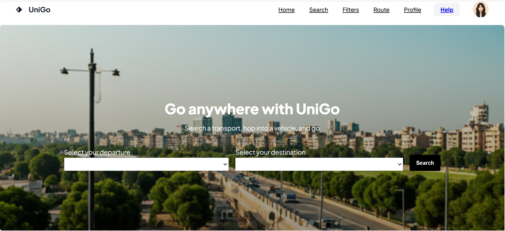

# UniGo – A Transport Finder

UniGo is a web-based application designed to help students and commuters quickly find transport options between major universities and key locations in Islamabad.  
The project aims to make travel planning easier by providing location-based search, route information, and filtering options — all in a simple and intuitive interface.

🌐 **Live Demo:** [View Project](https://ehsaan-qazi.github.io/UniGo-A-Transport-Finder/)

---

---

## 📌 Current Status

🚧 **In Development** – The interface is designed and basic navigation is ready.  
Dropdown selections, route display, and placeholder sections for future features are already in place.  
Some features are static for now but will be made functional in upcoming updates.

---

## ✨ Current Features

- **Clean Landing Page** – Modern, easy-to-use interface.
- **Departure & Destination Selection** – Choose from a list of universities and landmarks in Islamabad.
- **Popular Routes Section** – Displays example transport routes.
- **Navigation Menu** – Quick access to:
  - Home
  - Search
  - Filters
  - Route
  - Profile
  - Help
- **Responsive Layout** – Works on desktop and mobile devices.

---

## 🚀 Planned Features / Roadmap

- **Live Route Finder** – Show routes between selected locations with estimated travel time.
- **Transport Filters** – Filter by bus, shuttle, ride-share, fare, or departure time.
- **Fare Estimation** – Approximate travel costs for each option.
- **Real-Time Tracking** – Integration with live tracking APIs to monitor vehicle locations.
- **User Profiles** – Save favorite routes, view past searches, and customize preferences.
- **Help & Support** – Step-by-step guide, FAQs, and contact support.
- **Offline Mode** – View saved routes without internet connection.
- **Dark Mode** – Toggle between light and dark themes.

---

## 🛠️ Tech Stack

- **Frontend:** HTML, CSS, JavaScript  
- **Hosting:** GitHub Pages  
- **Planned Integrations:** Google Maps API, Location & Transit APIs

---

## 📅 Project Timeline

| Phase            | Status        | Description |
|------------------|--------------|-------------|
| UI Design        | ✅ Completed | Created navigation menu, dropdowns, and homepage layout. |
| Static Routes    | ✅ Completed | Added example "Popular Routes" section. |
| Routing Logic    | 🚧 In Progress | Building search and filter functionality. |
| API Integration  | ⏳ Upcoming  | Implement live transport data. |
| User Accounts    | ⏳ Upcoming  | Add login, profile, and route-saving features. |

---

## 🤝 Contributing

Contributions, ideas, and feedback are welcome!  
If you'd like to improve the UI, add features, or help with backend integration, feel free to open an issue or submit a pull request.

---

## 📄 License

This project is licensed under the [ Apache License 2.0](http://www.apache.org/licenses/).

---

### 👨‍💻 Author

**M. Ehsaan ur Rehman Qazi**  
- GitHub: [ehsaan-qazi](https://github.com/ehsaan-qazi)
- LinkedIn: [LinkedIn](https://www.linkedin.com/in/ehsaanqazi?utm_source=share&utm_campaign=share_via&utm_content=profile&utm_medium=android_app)
- Email: ehsaanbusinesshandle@gmail.com

